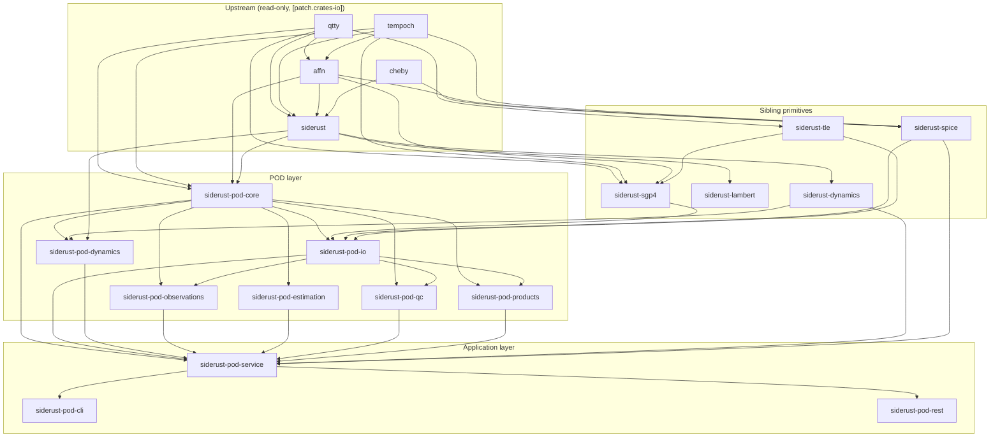
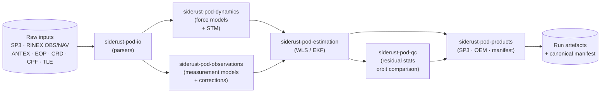

# Architecture Overview — A Diagrammatic Tour

This document gives a two-page tour of the `siderust-pod` workspace: the
crate graph, the data flow through a precise-orbit-determination (POD) run,
and how the workspace composes with its read-only upstream crates.

For the prose-heavy companion documents see
[`boundaries.md`](./boundaries.md), [`dependency-rules.md`](./dependency-rules.md),
[`providers.md`](./providers.md) and [`dispatch.md`](./dispatch.md).

---

## Crate Graph

The workspace contains 15 crates organised in four tiers:

1. **Upstream foundations** (`qtty`, `tempoch`, `affn`, `cheby`, `siderust`) —
   read-only, vendored at the workspace root and consumed via
   `[patch.crates-io]` redirections.
2. **Sibling primitive crates** (`siderust-{dynamics,lambert,sgp4,spice,tle}`) —
   reusable astronomy/astrodynamics building blocks that do not depend on any
   POD-specific concept.
3. **POD layer** (`siderust-pod-{core,dynamics,io,observations,estimation,qc,products}`) —
   POD-specific composition of the primitives.
4. **Application layer** (`siderust-pod-service`, `siderust-pod-cli`,
   `siderust-pod-rest`) — orchestration, CLI binary, and HTTP service.



The acyclicity of this graph is enforced by tooling (see
[`dependency-rules.md`](./dependency-rules.md)).

---

## Data Flow

A POD run is a deterministic, manifest-tracked transformation from raw
observation files to scientific products. The 15-stage pipeline is described
in detail in `siderust-pod-service`; the user-visible flow is:



`siderust-pod-service` orchestrates this flow; `siderust-pod-cli` and
`siderust-pod-rest` are thin frontends that hand a `RunConfig` to the service
and stream results back.

---

## Composition with Upstream

The POD workspace does **not** vendor or fork its foundational crates. It
consumes them as path overrides in the workspace `Cargo.toml`:

```toml
[patch.crates-io]
qtty-core    = { path = "../qtty/qtty-core" }
tempoch-core = { path = "../tempoch/tempoch-core" }
qtty         = { path = "../qtty/qtty" }
tempoch      = { path = "../tempoch/tempoch" }
affn         = { path = "../affn" }
siderust     = { path = "../siderust" }
```

This means:

- The five upstream trees (`qtty`, `tempoch`, `affn`, `cheby`, `siderust`)
  are **read-only** from the perspective of this workspace. Behavioural
  changes that belong upstream must be made in those trees first and then
  pulled in.
- POD never adds astronomy-domain concepts to upstream crates and never adds
  POD-specific assumptions to the primitives. The
  [separation-of-concerns rules](./boundaries.md) define which layer owns
  which concept.
- All POD crates pin their upstream deps through the workspace
  `[patch.crates-io]` section; individual crate `Cargo.toml` files refer to
  the regular crates-io names so the workspace can be built without the path
  overrides if a downstream user vendors a published version.

The POD layer is the *only* place where these primitives are composed into
end-to-end orbit-determination workflows; siblings such as `siderust-sgp4`
and `siderust-spice` remain pure primitive providers.
