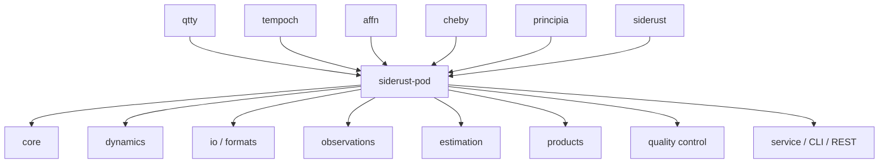
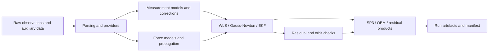

# Architecture Overview

`siderust-pod` is a single-crate precise-orbit-determination toolkit. Its
modules separate domain primitives, dynamics, observations, estimation,
formats, products, quality control, and application orchestration while
sharing one released dependency graph.

## Dependency structure

The crate consumes `qtty`, `tempoch`, `affn`, `cheby`, `principia`, and
`siderust` from crates.io. Siderust owns foundational astronomy and
astrodynamics. Principia owns reusable numerical mechanics. This repository
adds POD-specific composition and applications; it does not vendor or patch
those upstream crates.

The dependency check in `scripts/check_dep_graph.sh` rejects path and git
dependencies and verifies the locked graph can be resolved from the
standalone checkout.

## Data flow

A POD run is a deterministic, manifest-tracked transformation from raw
observations and supporting products into an estimated orbit and quality
artefacts.

The CLI and REST binaries are thin front ends over the service module. The
scientific layers remain independently testable, with typed quantities,
time scales, centers, and frames preserved at their boundaries.
