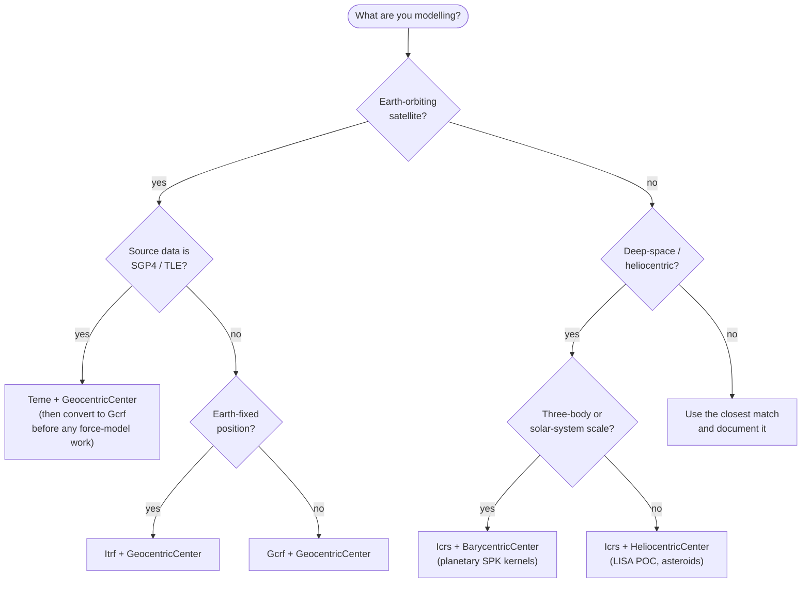

# Frames and Centers — A Cookbook

Picking the right frame/center pair is the most common source of subtle
bugs in orbit-determination code. This cookbook gives a short answer for
every common situation in the POD workspace.

## Frame markers (from `affn`)

| Marker  | Full name                                          | Use for                                                                 |
|---------|----------------------------------------------------|-------------------------------------------------------------------------|
| `Teme`  | True Equator, Mean Equinox (of date)               | SGP4/SDP4 native output. **Always convert to GCRF before propagation.** |
| `Gcrf`  | Geocentric Celestial Reference Frame               | Inertial frame for Earth-orbiting satellites; the workhorse in `siderust-pod-dynamics`. |
| `Icrs`  | International Celestial Reference System           | Deep-space and heliocentric work, including the LISA POC. Aligns with GCRF at the ε level. |
| `Itrf`  | International Terrestrial Reference Frame          | Earth-fixed: ground-station coordinates, EOP-driven GCRF↔ITRF transforms, surface displacements. |
| `J2000` | Mean equator/equinox of J2000.0                    | **Legacy.** Avoid in new code; prefer GCRF.                             |

Cross-frame transforms live in `siderust` (precession-nutation, polar
motion, EOP application) and are surfaced through the
`FrameTransformProvider` trait in `siderust-pod-dynamics`.

## Center markers (from `affn`)

| Marker              | Use for                                                          |
|---------------------|------------------------------------------------------------------|
| `GeocentricCenter`  | Earth-orbiting satellites, ITRF coordinates, GNSS LEO POD.       |
| `BarycentricCenter` | Solar-system barycentre; deep-space planetary work, SPK kernels. |
| `HeliocentricCenter`| Sun-centred work; the LISA POC three-spacecraft constellation.   |
| `TopocentricCenter` | Station-relative directions / range vectors (rare in POD core).  |

## Decision flowchart



## Quick-reference: typical pipelines

### GNSS LEO POD (the MVP-1 path)

```text
RINEX OBS (station obs)         ─▶  Itrf + Geocentric  ─▶  Gcrf at obs epoch
SP3 reference orbit             ─▶  Itrf + Geocentric  ─▶  Gcrf at SP3 epoch
EKF / WLS state                 ─▶  Gcrf + Geocentric
SLR validation                  ─▶  Itrf station + Gcrf orbit
SP3 product (output)            ─▶  Itrf + Geocentric
```

### SGP4 propagation

```text
TLE elements    ─▶  SGP4 model  ─▶  Position/Velocity in Teme + Geocentric
                                 ─▶  convert to Gcrf for any downstream POD work.
```

### LISA POC (deep-space)

```text
esa/lisa-orbit-files            ─▶  Icrs + Heliocentric (per-spacecraft)
Inter-spacecraft range model    ─▶  consumes Icrs + Heliocentric directly
```

## Anti-patterns

- ❌ Mixing `Teme` and `Gcrf` in the same arithmetic. Always transform first.
- ❌ Using `J2000` in new code. It exists for legacy interop only.
- ❌ Storing positions as `[f64; 3]` with a frame written in a comment.
- ❌ Doing a "frame transform" by re-naming the type. Use the
  `FrameTransformProvider` trait so EOP corrections are applied correctly.

When in doubt, look at the type signature: if the frame and center are
encoded in the type, the compiler will tell you which transform you forgot.
