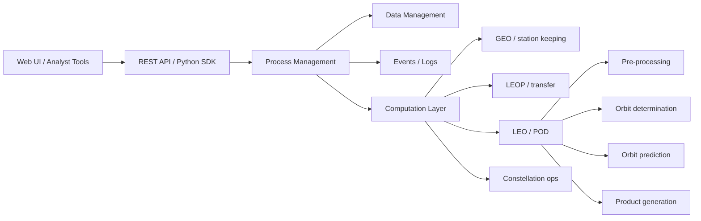
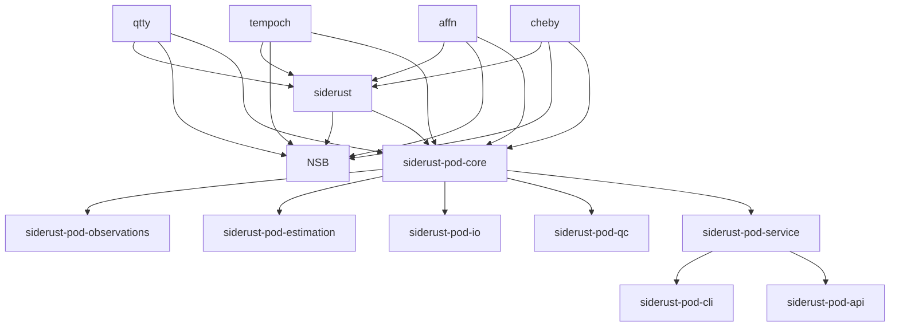
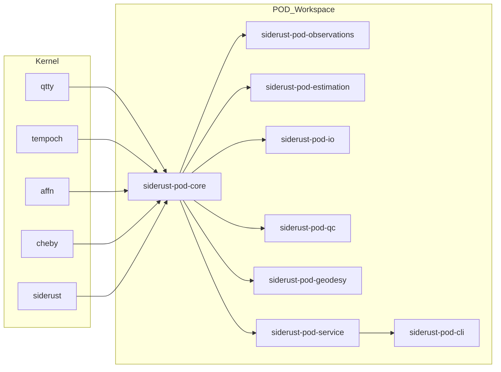

# GMV FocusPOD, the POD Market, and a Siderust Parity Roadmap

## Executive summary

urlGMVhttps://www.gmv.com/en-es’s entity["software","FocusPOD","GMV precise orbit determination and geodesy software"] is not just a numerical orbit solver. Public GMV material positions it as a proprietary, end-to-end POD and geodesy stack for LEO missions that combines multi-technique estimation, operational quality control, simulation, standard geodetic file I/O, and cloud-oriented deployment. Official GMV sources publicly claim operational use in the entity["organization","Copernicus Programme","European Union Earth observation programme"] POD service, support for GNSS, SLR, DORIS, and VLBI workflows, and performance targets of under 5 cm 3D RMS in under 5 minutes, under 2 cm in one day, and under 1 cm in three weeks for the publicly described Copernicus use case. GMV also places FocusPOD inside a broader operations stack that includes entity["software","FocusSuite","GMV flight dynamics suite"], entity["software","Hifly","GMV satellite monitoring and control system"], entity["software","Magnet","GMV ground station monitoring and control system"], and entity["software","Focusoc","GMV conjunction assessment and collision avoidance service"], which matters because part of GMV’s competitive advantage is system integration, not only POD math. citeturn6search0turn23view0turn23view3turn24view1turn25view0turn20view0turn20view2turn21search1turn21search15

The current public urlSiderust organizationturn16search2 already has unusually strong foundations for a Rust-native competitor: `qtty` for dimensional correctness, `tempoch` for time scales and EOP infrastructure, `affn` for typed frames/centers/geometry, `cheby` for interpolation and approximation, and `siderust` for astronomy, ephemerides, coordinates, and physical modeling. The public `siderust` README also explicitly signals future batch orbit-determination helpers and notes that RTN/RIC covariance transport is not yet first-class, which aligns closely with the biggest gap between Siderust today and FocusPOD-class systems. Based on the repo tree you provided, the missing center of gravity is not mathematical infrastructure but an operational POD layer: measurement ingestion, estimators, partial derivatives, ambiguity handling, product I/O, residual/QC tooling, batch and sequential solvers, and service orchestration. citeturn15view0turn15view1turn15view3turn16search2

The most credible parity strategy is therefore **not** to overload the existing `siderust` crate with every geodetic and operational concern. The better architecture is a new `siderust-pod` workspace layered on top of existing crates. In that split, `qtty`, `tempoch`, `affn`, `cheby`, and `siderust` remain reusable kernels; POD-specific crates handle observations, estimation, QC, standard products, and cloud/runtime concerns. That architecture mirrors the separation publicly described by GMV for FocusPOD and the service/API layering publicly described for FocusSuite, while preserving Siderust’s current strength as a type-safe scientific kernel. citeturn22search0turn25view0turn24view2turn24view3turn20view2

The priority sequence is straightforward. **P0** should target GNSS-based LEO POD parity: deterministic time/frame kernels, force and observation models with analytic partials, batch least squares, sequential EKF, standard GNSS/SP3/SINEX-style I/O, and automated QC. **P1** should add multi-technique support and serviceization: SLR, DORIS, mission satellite macro-models, residual analytics, provenance, REST/CLI jobs, and scalable processing. **P2** should add the genuinely differentiating geodesy features: VLBI, normal-equation stacking, GNSS network processing, TRF-like global solutions, and a polished operations UI. That ordering reflects what GMV publicly documents, what the competing toolchain landscape shows, and what Siderust already has versus what it lacks. citeturn24view1turn25view0turn20view4turn28academia42turn11search1turn27search3

## Research baseline and source hierarchy

You asked that research begin with four priority sites, in this order: urlGitHubhttps://github.com, urlGMVhttps://www.gmv.com/en-es, urlCelesTrakhttps://celestrak.org, and urlSatellite Tracker 3Dhttps://satellitetracker3d.com. That sequence turned out to be useful rather than arbitrary: GitHub anchored the current public Siderust organization and public roadmap signals; GMV provided the primary evidence for FocusPOD and FocusSuite capabilities; CelesTrak provided current public realities about operational orbit-data interchange and the shift from legacy TLE toward CCSDS OMM-compatible formats; Satellite Tracker 3D showed what a modern lightweight orbit visualization and tracking frontend built on TLE/SGP4 looks like, which is not a direct POD competitor but is a useful benchmark for public-facing analysis UX. citeturn16search2turn15view1turn6search0turn23view0turn8search1turn9search0

| Priority site | Why it mattered | What it changed in this report |
|---|---|---|
| urlGitHubhttps://github.com | Confirmed the public Siderust org structure and the public `siderust` README roadmap, including explicit future LSQ/EKF helpers and the current absence of first-class RTN/RIC covariance transport. citeturn16search2turn15view1turn15view3 | Anchored the current-state inventory and the recommended crate split. |
| urlGMVhttps://www.gmv.com/en-es | Supplied the official FocusPOD page, brochure, FocusSuite page, FocusSuite white paper, and license documents. citeturn6search0turn23view0turn24view1turn20view2turn23view1turn6search1 | Established the authoritative capability catalog and the parity target. |
| urlCelesTrakhttps://celestrak.org | Documented the active industry move from legacy TLE to OMM/XML/JSON/CSV, including 6-digit catalog numbers and explicit rate-limit expectations. citeturn8search1 | Informed fixture design and the requirement for modern orbital-data import/export. |
| urlSatellite Tracker 3Dhttps://satellitetracker3d.com | Showed a browser-based tracking UX using TLE and SGP4 for more than 24,000 satellites, with graphing and search. citeturn9search0 | Informed the optional P2 visualization and public-analysis layer, not core POD parity. |

After those four sites, the most useful additional sources were official product pages and official documentation for urlAnsys ODTKturn10search0, urlFreeFlyerhttps://ai-solutions.com/freeflyer-astrodynamic-software/, urlOrekitturn10search5, urlGMATturn10search6, urlTudatturn13search19, urlGROOPSturn13search6, urlBernese GNSS Softwareturn11search2, and urlGipsyXturn11search3, together with primary papers and public abstracts where official marketing pages did not provide meaningful algorithmic detail. citeturn10search0turn10search4turn10search5turn10search6turn13search19turn13search6turn11search2turn11search3turn28academia42turn11search30turn11search24

## FocusPOD and the adjacent GMV software stack

GMV’s official FocusPOD product page describes a proprietary “end-to-end solution for Precise Orbit Determination and Geodesy,” powered by GMV MAORI, with high-precision LEO orbit and clock determination from GNSS, built-in quality control, SLR processing, GNSS sensor-performance analysis, and simulation support. GMV’s brochure and 2026 geodesy abstract extend that public picture: FocusPOD is written in modern C++ and Python, is library-oriented, separates data from algorithms, uses a centralized data model, supports multi-use-case operation from analyst workflows to machine-to-machine interfaces, and now publicly claims GNSS, DORIS, SLR, and VLBI processing plus ongoing work on normal-equation stacking and GNSS network processing. GMV’s license agreement also makes clear that the commercial product is licensed as proprietary software in executable form, not an open-source library. citeturn7search1turn24view1turn25view0turn6search1

urlFocusPOD official pageturn6search0

urlFocusPOD brochureturn6search2

The capability envelope that shows up consistently across official GMV product material, brochure pages, and public conference abstracts is broader than “GNSS POD” in the narrow sense. GMV publicly documents: state-of-the-art geophysical models and conventions; weighted least squares and extended Kalman filtering; ambiguity handling; estimation of orbital, geophysical, and observation parameters; interfaces for RINEX, SP3, SINEX, ORBEX, vgosDB, CRD, CPF, and ANTEX; multi-technique processing; and a QC workflow that includes residual analysis, combined solutions, spectral error analysis, and sensor assessment. GMV also publicly associates FocusPOD with Copernicus operations, Galileo system test-bed simulation, Galileo Reference Centre VLBI processing, and LEO-PNT validation work. citeturn24view1turn6search0turn25view0

| Capability family | What official GMV sources publicly show | Why it matters for Siderust parity |
|---|---|---|
| Core estimation | Weighted least squares and extended Kalman filtering; orbital, geophysical, GNSS, DORIS, and VLBI parameter estimation. citeturn24view1 | Siderust needs a dedicated estimator layer, not only propagators and transforms. |
| Measurement techniques | GNSS, SLR, DORIS, and VLBI are all publicly documented, with VLBI recently added in the 2026 abstract. citeturn24view1turn25view0 | A GNSS-only first release is viable, but real parity requires a multi-technique architecture from the start. |
| Standards and products | RINEX, SP3, SINEX, ORBEX, vgosDB, CRD, CPF, ANTEX are explicitly listed. citeturn24view1 | Product I/O is a first-class competitive feature, not a side task. |
| QC and analysis | Combined solutions, residual analysis, time-series comparisons, geographic error plotting, spectral error analysis, GNSS sensor performance. citeturn6search0turn24view1 | POD parity requires a QC/reporting subsystem, not only a solver. |
| Simulation | Orbit, clock, attitude, and observation simulation are explicitly public capabilities. citeturn6search0turn24view1 | Siderust should treat simulation as part of validation and mission design, not an external script. |
| Performance | Public claim: <5 cm 3D RMS in <5 min, <2 cm in one day, <1 cm in three weeks for the published Copernicus use case. citeturn23view0turn24view1 | These numbers are the clearest public parity targets available. |

FocusPOD also benefits from being adjacent to the wider GMV stack rather than living alone. Official GMV sources describe FocusSuite as a cloud-native, web-based, full-lifecycle flight-dynamics suite with Python/SOL automation, REST API, Python SDK, OAuth2/OpenID integration, database-driven architecture, parallel processing, and mission products across GEO, LEOP, LEO, and constellation operations. The white paper shows a layered architecture with GUI/API, process management, data management, event logging, and computation layers; the product page adds batch, sequential, and Kalman orbit-determination algorithms and integrations with mission-control systems such as GMV’s Hifly, ESA SCOS2000, and Kratos EPOCH. In other words, GMV’s public posture is architectural as much as algorithmic. citeturn20view0turn20view2turn20view4turn24view2turn24view3turn24view4



For Siderust, that implies a sharp design conclusion: **competing with FocusPOD alone requires estimation parity; competing with GMV in practice requires a separable service/API/runtime layer that can later plug into mission-control and monitoring systems.** That is why the recommended implementation below separates `siderust` the scientific kernel from a new `siderust-pod` workspace for observations, estimation, QC, and services. citeturn24view2turn24view3turn20view2turn20view4

## Competing POD and flight-dynamics products

The current comparison set falls into three groups. First are commercial COTS products with mature operations tooling, such as ODTK and FreeFlyer. Second are open-source flight-dynamics frameworks such as Orekit, GMAT, Tudat, and GROOPS. Third are research or agency-grade licensed tools such as Bernese and GipsyX. The key market pattern is that only a few products publicly present a complete “operations + estimation + QC + file standards + service architecture” story. GMV FocusPOD/FocusSuite, Ansys ODTK, and FreeFlyer are closest to that complete picture in public materials. The open-source tools are strong but more framework-like, leaving more integration work to the adopter. citeturn10search0turn10search4turn10search5turn10search6turn13search19turn13search6turn11search2turn11search3

| Product | Category / license | Publicly evidenced capabilities | Public maturity / accuracy evidence | Relative to FocusPOD |
|---|---|---|---|---|
| entity["software","FocusPOD","GMV precise orbit determination and geodesy software"] | Proprietary GMV product; executable-form commercial licensing. citeturn6search1turn7search1 | GNSS, SLR, DORIS, VLBI; QC; simulation; standard geodetic file interfaces; multi-use-case library architecture. citeturn24view1turn25view0 | Public GMV claim: <5 cm 3D RMS in <5 min, <2 cm in one day, <1 cm in three weeks; operational Copernicus use. citeturn23view0turn6search0 | Benchmark target. |
| urlAnsys ODTKturn10search0 | Commercial proprietary. citeturn10search0 | 100+ measurement models, realistic covariance, traditional and nontraditional measurements, sequential filter and smoother, raw GNSS support. citeturn10search0turn10search25turn14search6 | Strong commercial maturity; no single public product-wide cm figure located in the official pages reviewed. citeturn10search0turn10search28 | Closest commercial peer on estimation depth and covariance realism; less public evidence than GMV on multi-technique geodesy breadth. |
| urlFreeFlyerhttps://ai-solutions.com/freeflyer-astrodynamic-software/ | Commercial proprietary, ITAR-free marketing position. citeturn10search4 | Batch LS, EKF, SRIF, UKF, measurement simulation, tracking-data editing, thrust-event estimation, scripting, full mission lifecycle. citeturn14search4turn14search7turn14search11turn14search15 | Heritage on 250+ missions per official public material; no single public product-wide POD accuracy claim located in the official material reviewed. citeturn10search4 | Very strong operations framework; public geodesy-specific depth appears less explicit than FocusPOD. |
| urlOrekitturn10search5 | Open source, Apache 2.0. citeturn12search1turn12search9 | Low-level space-dynamics library; orbit-determination framework with batch least squares, multiple propagators, tutorials for sequential methods. citeturn10search2turn14search2turn14search12 | Mature community library with broad industrial adoption; no product-wide public accuracy claim located. citeturn10search5turn10search34 | Strongest open-source framework analogue to the future Siderust kernel; weakest on turnkey ops/QC UX unless integrator builds it. |
| urlGMATturn10search6 | Open source, Apache 2.0. citeturn27search3turn27search9 | Mission design and navigation, operational orbit determination, batch and EKFS, measurement simulation, rich scripting and GUI. citeturn27search3turn27search4turn27search7turn27search12 | Strong mission-operations heritage; public docs cite operational use for SOHO, ACE, Wind, SDO, and TESS-related work. citeturn27search1 | Strong open alternative for mission/OD workflows; less obviously positioned as a modern multi-technique space-geodesy platform than FocusPOD. |
| urlTudatturn13search19 | Open source, BSD-style permissive. citeturn13search19turn13search3 | Numerical propagation and estimation for spacecraft and celestial bodies; real tracking-data estimation in newer work. citeturn11search0turn13search7turn11search24 | Recent published examples report post-fit Doppler residuals of 1–5 mHz and meter-level orbit differences in representative deep-space cases. citeturn11search24 | Excellent research platform; less publicly positioned than FocusPOD for operational geodesy pipelines and standard operational products. |
| urlGROOPSturn13search6 | Open source, GPLv3. citeturn13search6turn13search18 | Gravity-field recovery, GNSS processing, time-series statistics, LEO orbit determination, GNSS constellation and station-network analysis. citeturn11search1turn11search9 | Strong geodesy relevance; no simple product-wide public mission-operations accuracy figure located. citeturn11search1 | Very relevant to the geodesy side of FocusPOD; less of an end-to-end operations product. |
| urlBernese GNSS Softwareturn11search2 | Commercial / research licensing. citeturn13search0turn13search8 | High-precision multi-GNSS processing; used by CODE; LEO POD based on GPS and SLR validation support. citeturn11search2turn11search14 | Representative literature reports dynamic GPS-based LEO POD with about 1 cm 3D RMS in reduced-dynamic mode for studied cases. citeturn11search30 | Strong benchmark for precise GNSS/LEO POD, but narrower as a full mission-ops product. |
| urlGipsyXturn11search3 | Licensed JPL software, not open-source. citeturn13search1turn13search13 | GNSS/SLR/DORIS with Kalman filtering, real-time and post-processing, geodetic parameter estimation, ambiguity resolution. citeturn11search11turn28academia42 | Published performance includes <5 cm URE in real-time OCX/GDGPS contexts and 2 cm RMS in precision post-processing, plus GRACE relative clock alignment at 20 ps. citeturn28academia42 | Probably the closest published research/operations analogue to FocusPOD’s multi-technique geodesy ambition. |

Two conclusions matter most for Siderust. First, the commercial market wins on **workflow completeness**: APIs, GUI, automation, products, and quality reporting. Second, the highest-end geodesy tools win on **multi-technique estimation and combination**, not on orbital propagation alone. That means a Siderust competitor that only reaches “Orekit-like astrodynamics plus a least-squares fitter” will still fall short of FocusPOD-class parity. True parity requires coupling an `Orekit/Tudat`-style kernel with `GipsyX/GROOPS/Bernese`-style estimation depth and then wrapping it in an `ODTK/FreeFlyer/FocusSuite`-style operational surface. citeturn10search0turn10search4turn10search5turn11search1turn28academia42

## Siderust org inventory and the current gap to FocusPOD

Cross-checking the public Siderust organization with the repo tree you provided shows a coherent layered ecosystem already exists. The public organization describes `qtty` as a quantity/dimensional-analysis crate, `affn` as a strongly typed affine/frame kernel, `tempoch` as a high-precision time crate, and `siderust` as a reference ephemeris and orbit-analysis library. The public `siderust` README also documents pluggable ephemeris backends, strong frame/center typing, altitude APIs, observatories, targets, `ffi`, and a roadmap that still lists batch orbit-determination helpers as future work. citeturn16search2turn15view0turn15view1

| Crate / project | Present role in the org | Why it is strategically important for POD | Main gap versus FocusPOD |
|---|---|---|---|
| `qtty` | Strongly typed physical quantities, units, FFI support, and broad unit catalog, with public no_std support in subcrates. citeturn16search2turn15view0 | Ideal foundation for dimensional safety in force, observation, covariance, and product I/O code. | Needs more geodesy/POD-specific quantity conventions and serialization schemas. |
| `tempoch` | Time scales, tagged times, EOP data infrastructure, generated time data, updater crates. | Exact time-scale conversions are non-negotiable for POD and geodesy. | Needs first-class integration with OD arcs, measurement epochs, leap/EOP provenance, and operational product timestamps. |
| `affn` | Compile-time-safe centers, frames, positions, directions, vectors, conics. | Excellent basis for typed state vectors, frame transforms, and covariance transport. | Still lacks first-class RTN/RIC covariance and OD-state abstractions in the public README. citeturn15view3 |
| `cheby` | Approximation, interpolation, calculus, spectral tools, binary/serde I/O, piecewise tables. | Very strong for ephemerides, force-model tables, and deterministic replay/compression of reference curves. | Not yet attached to a POD estimator or normal-equation workflow. |
| `siderust` | Astronomy, time, coordinates, ephemerides, atmosphere, bodies, targets, FFI. | It already looks like the correct physics kernel for a future POD stack. | Publicly still missing first-class batch OD helpers, sequential OD, covariance transport, observation modeling, and geodetic product I/O. citeturn15view1turn15view3 |
| `NSB` | Night-sky brightness and atmosphere/radiometry modeling. | Orthogonal to POD, but useful for Earth-observation mission analysis and optical planning. | Should stay separate from POD core to avoid scope dilution. |

The most important architectural fact is that Siderust already has the **kernel pieces** but not the **POD assembly**. Your tree shows ephemerides, EOP data management, atmosphere models, coordinate transforms, targets, interpolation, FFI, and typed units; what it does not yet show is a POD-specific workspace with observation traits, residual pipelines, Jacobian infrastructure, estimator interfaces, ambiguity resolution, standard geodetic product codecs, covariance products, and job-level orchestration. That is exactly the seam where a `siderust-pod` specialization should sit. citeturn15view0turn15view1turn24view1turn25view0



The gap to FocusPOD can therefore be described precisely:

- **Already strong in Siderust:** compile-time-safe units and frames; time systems and EOP foundations; high-precision ephemerides; interpolation; physical modeling scaffolding; FFI surface; validation culture. citeturn15view0turn16search2
- **Partially present:** satellite and atmosphere modeling, data managers, tables, targets, coordinate transforms, observatories, Chebyshev/data plumbing. citeturn15view0
- **Not yet first-class:** batch LSQ/SRIF/EKF engines; measurement-model abstraction; ambiguity resolution; standard POD/geodesy file I/O; residual and QC tooling; station and troposphere estimation; SLR/DORIS/VLBI support; operational product generation; service APIs; cloud/distributed job orchestration; analyst UI. citeturn15view1turn15view3turn24view1turn20view2

That is why the right competitive move is **crate specialization**, not monolith expansion. Let `siderust` remain the reusable astrodynamics/scientific core, and let a new dedicated project absorb the mission-specific operational mass. That mirrors both FocusPOD’s public library-centric design and FocusSuite’s public service-oriented layering. citeturn22search0turn25view0turn24view2turn24view3

## Requirements and test specifications

The recommended architecture is a two-level plan. The **existing crates** remain the base scientific substrate. Above them, a **new POD workspace** should carry every feature whose purpose is estimation, operational product handling, QC, or service orchestration. This keeps Siderust competitive against both open-source libraries and commercial operational suites: the kernel stays elegant; the product stack becomes opinionated. citeturn15view0turn24view2turn24view3



### High-level requirements

| ID | High-level shall statement | Owner crate / project | Priority | Complexity |
|---|---|---|---|---|
| HR-A | The Siderust ecosystem shall provide a dedicated POD core that represents states, force-model settings, estimation parameters, covariances, and provenance as typed Rust structures with deterministic serialization. | `siderust-pod-core` + `qtty` + `tempoch` + `affn` | P0 | Medium |
| HR-B | The ecosystem shall support GNSS-based LEO POD with batch least squares and sequential EKF processing, including analytic partial derivatives and configurable solve-for sets. | `siderust-pod-estimation` + `siderust-pod-observations` | P0 | High |
| HR-C | The ecosystem shall ingest and emit the minimum operational standards needed for core POD workflows, starting with RINEX, SP3, ANTEX, EOP products, OEM/OPM, and SINEX-like solution outputs. | `siderust-pod-io` + `tempoch` + `cheby` | P0 | High |
| HR-D | The ecosystem shall provide residual analytics, orbit-comparison tooling, covariance export, and machine-readable QC reports so that every estimation run is auditable. | `siderust-pod-qc` | P0 | Medium |
| HR-E | The ecosystem shall support SLR as both a validation technique and an estimated measurement source, including CRD/CPF parsing and station/range-bias handling. | `siderust-pod-observations` + `siderust-pod-io` | P1 | High |
| HR-F | The ecosystem shall support DORIS processing and parameter estimation with mission-appropriate frequency/bias handling. | `siderust-pod-observations` + `siderust-pod-estimation` | P1 | High |
| HR-G | The ecosystem shall estimate mission-critical dynamical nuisance parameters, including drag, SRP scale factors, empirical accelerations, and maneuver parameters. | `siderust-pod-core` + `siderust-pod-estimation` + `siderust` | P1 | High |
| HR-H | The ecosystem shall support reproducible simulation of orbits, clocks, attitudes, and measurements with configurable noise and truth-vs-estimate comparisons. | `siderust-pod-core` + `siderust-pod-qc` | P1 | Medium |
| HR-I | The ecosystem shall expose a job-oriented CLI and service API for batch execution, result retrieval, and provenance tracking. | `siderust-pod-service` + `siderust-pod-cli` | P1 | Medium |
| HR-J | The ecosystem shall add multi-technique geodesy features, including VLBI-ready abstractions, normal-equation stacking, and GNSS network processing, without breaking the GNSS LEO POD path. | `siderust-pod-geodesy` | P2 | High |
| HR-K | The ecosystem shall provide first-class RTN/RIC covariance transport and frame-aware uncertainty products. | `affn` + `siderust-pod-core` | P0 | Medium |
| HR-L | The ecosystem shall remain usable as a library and as a service, so the same computation kernels are shared between interactive analysis, automation, and distributed operations. | Whole workspace | P0 | Medium |

### Low-level requirements

| ID | Low-level shall statement | Owner | Priority | Complexity |
|---|---|---|---|---|
| LR-A | `tempoch` shall expose POD-safe conversions among UTC, TAI, TT, TCG, TDB, and mission epochs, with explicit EOP/leap-second provenance attached to every run. | `tempoch` | P0 | Medium |
| LR-B | `affn` and `siderust` shall expose a typed OD state representation carrying frame, center, and covariance together, with compile-time prevention of mixed-frame residuals. | `affn` + `siderust-pod-core` | P0 | Medium |
| LR-C | Force models shall expose acceleration and state/parameter Jacobians through one trait so the same models work in propagators, batch LSQ, and EKF. | `siderust-pod-core` | P0 | High |
| LR-D | Observation models shall expose predicted measurements, prefit residuals, and analytic Jacobians for GNSS pseudorange and carrier phase at minimum. | `siderust-pod-observations` | P0 | High |
| LR-E | The batch estimator shall support state, clock, bias, ambiguity, and selected dynamical parameter estimation in one solve. | `siderust-pod-estimation` | P0 | High |
| LR-F | The sequential estimator shall support configurable process noise, time updates, measurement updates, and optional fixed-interval smoothing. | `siderust-pod-estimation` | P0 | High |
| LR-G | The QC layer shall emit structured outputs for residual statistics, rejected observations, parameter sigmas, covariance consistency, and orbit-difference metrics. | `siderust-pod-qc` | P0 | Medium |
| LR-H | The I/O layer shall preserve forward compatibility with OMM/OEM/OPM-style ecosystems and with current public GP/OMM data practices documented by CelesTrak. | `siderust-pod-io` | P1 | Medium |
| LR-I | The product layer shall emit deterministic filenames, metadata manifests, checksums, and run digests so any product can be regenerated exactly. | `siderust-pod-service` + `siderust-pod-io` | P1 | Medium |
| LR-J | The simulation layer shall support truth generation, noise injection, bias injection, outage injection, and Monte Carlo ensembles. | `siderust-pod-core` + `siderust-pod-qc` | P1 | Medium |
| LR-K | The service layer shall support headless execution from YAML/TOML/JSON configs as well as a stable Rust API. | `siderust-pod-service` + `siderust-pod-cli` | P1 | Medium |
| LR-L | The geodesy layer shall support NEQ accumulation/stacking, station coordinates, EOP estimation, and troposphere-related state components. | `siderust-pod-geodesy` | P2 | High |

### Concrete test cases

Public fixtures should primarily come from entity["organization","CelesTrak","orbital data service"] for OMM/TLE cases, the entity["organization","Copernicus Programme","European Union Earth observation programme"] POD public documentation for Sentinel product formats, the entity["organization","International GNSS Service","geodetic GNSS consortium"] ecosystem for RINEX/SP3/ANTEX-compatible cases, the entity["organization","International Laser Ranging Service","satellite laser ranging service"] for CRD/CPF-style SLR cases, and the entity["organization","International DORIS Service","DORIS geodesy service"] ecosystem for DORIS examples. CelesTrak’s current documentation is especially important because it explicitly documents the active OMM transition beyond legacy TLE. citeturn8search1turn17search7turn17search12

| Requirement | Unit test | Integration test | Regression test | Benchmark | Pass criteria | Suggested fixtures |
|---|---|---|---|---|---|---|
| HR-A / LR-A / LR-B | Time-scale round trips; frame-tagged state serialization; covariance-frame transforms. | Load config → propagate tagged state → save manifest → reload and compare bitwise metadata. | Re-run same job twice and compare hashes of products and manifest. | Serialization/deserialization throughput. | No time-scale round-trip error beyond 1 ns-equivalent for supported representations; manifest deterministic across runs; mixed-frame operations fail at compile time or explicit runtime validation. | Synthetic epochs; public EOP/leap inputs; current Siderust typed-frame tests. |
| HR-B / LR-C / LR-D / LR-E | Analytic Jacobians versus finite-difference Jacobians for GNSS models. | Full synthetic GNSS LEO batch POD recovering truth from perturbed initial state and noisy measurements. | Reproduce a frozen GNSS fixture arc and verify unchanged parameter estimates within tolerance after code changes. | One-satellite 24 h batch solve. | Jacobian relative error < 1e-6 on test points; synthetic 24 h 3D RMS < 2 cm; solution parameters fall within 3σ of truth; no residual-bias drift after convergence. | Synthetic truth generator; public RINEX/SP3/ANTEX-style fixtures; Copernicus product formats for output structure. |
| HR-B / LR-F | EKF measurement-update algebra and process-noise propagation. | Sequential EKF on same synthetic arc as batch solve. | Fixed fixture where EKF and batch LSQ should agree on a stable arc. | NRT-like sequential processing latency. | EKF-vs-batch 3D RMS difference < 2 cm on stable arcs; covariance remains positive semi-definite; no filter divergence on gap/restart cases. | Synthetic GNSS arc with outages and clock events. |
| HR-C / LR-H | Parser round-trip tests for RINEX/SP3/ANTEX/OEM/OPM/SINEX-like metadata. | Ingest public files → estimate → emit products → re-read emitted products in independent reader. | Golden files for every supported standard version. | Large-file parse rate and memory footprint. | Round-trip preserves mandatory semantics; parsed epochs/counts/checksums match expected values; malformed files fail with typed diagnostics. | CelesTrak GP/OMM samples; Copernicus POD format docs; public GNSS sample files. |
| HR-D / LR-G | Residual histogram, sigma-edit, and report schema unit tests. | End-to-end QC report generation from a solved arc. | Freeze QC JSON and plot summaries for known fixture. | Residual pipeline throughput at constellation scale. | QC JSON validates against schema; orbit-difference metrics reproduced within tolerance; outlier counts stable on fixed fixtures. | Synthetic plus one public frozen fixture arc. |
| HR-E | SLR range model and station-bias Jacobian tests. | SLR-only and GNSS+SLR combined fit on synthetic LEO orbit. | Public SLR validation case with frozen residual summary. | CRD/CPF ingest + batch validation runtime. | Synthetic SLR-only orbit recovery meets predeclared cm-level thresholds; combined GNSS+SLR solution shall reduce external validation residuals versus GNSS-only baseline. | ILRS-style CRD/CPF public examples; Copernicus/Sentinel SLR-compatible public orbit cases where available. |
| HR-F | DORIS observable reconstruction and bias-state unit tests. | DORIS-only and combined DORIS+GNSS synthetic estimation. | Frozen DORIS fixture with stable pass-level bias outputs. | DORIS pass pre-processing runtime. | Pass grouping and bias estimation stable; combined solution improves or matches truth relative to single-technique baseline on synthetic fixtures. | IDS-style DORIS examples; synthetic pass generator. |
| HR-G | Drag/SRP/empirical-acceleration partial derivative tests. | Solve-for Cd/Cr/empirical terms on synthetic disturbed arc. | Frozen nuisance-parameter estimates for fixture scenes. | Propagation cost with and without partials. | Estimated nuisance parameters recover truth within 3σ on synthetic cases; enabling corresponding solve-fors reduces residual systematics. | Synthetic truth with known Cd/Cr and empirical accelerations. |
| HR-H / LR-J | Noise injector, outage injector, and Monte Carlo sampler tests. | Truth → simulated measurements → solve → compare recovery statistics. | Freeze Monte Carlo summary metrics with seeded RNG. | 100-run Monte Carlo throughput. | Monte Carlo coverage close to theoretical expectation; seeded runs are exactly reproducible. | Pure synthetic. |
| HR-I / LR-I / LR-K | CLI config parsing and manifest schema tests. | Run job via CLI, API, and file-based batch mode and compare outputs. | Backward-compatibility tests for config versions. | Multi-job queue throughput. | CLI/API parity; deterministic run IDs; provenance complete enough to replay job exactly. | Synthetic plus frozen public fixture jobs. |
| HR-J / LR-L | NEQ build/stack algebra and station/EOP state tests. | Multi-arc stacking over synthetic station + satellite network. | Frozen stacked-solution summaries. | NEQ build/stack throughput and memory. | Stacked and monolithic solutions agree within tolerance on synthetic truth; station/EOP states consistent across repeated runs. | Synthetic geodesy network first; public multi-technique fixtures later. |
| HR-K | RTN/RIC frame basis and covariance-transform unit tests. | Compare Cartesian covariance → RTN/RIC → Cartesian round trips in solved arcs. | Freeze uncertainty products for selected reference cases. | Covariance transport runtime. | Round-trip covariance error below numeric tolerance; positive semi-definiteness preserved. | Synthetic state/covariance sets; current Siderust orbital-frame tests extended. |
| HR-L | Shared-kernel API contract tests between library and service modes. | Same core solve invoked from Rust API and service worker. | Semver/API compatibility suite. | None beyond service overhead tracking. | Numerical equality to within machine precision for identical configs and fixtures. | Synthetic plus frozen batch jobs. |

### Recommended command surface and example configuration

The following example is **proposed**, not a description of current Siderust behavior. It is meant to force the architecture to stay executable, testable, and automation-friendly.

```yaml
# configs/sentinel3a_gnss_batch.yaml
mission:
  id: sentinel3a-demo
  mode: batch_lsq
  satellite_model: sentinel3a_boxwing

inputs:
  rinex_obs: fixtures/gnss/S3A/*.rnx
  sp3_orbits: fixtures/gnss/igs/*.sp3
  clocks: fixtures/gnss/igs/*.clk
  antex: fixtures/gnss/igs/igs20.atx
  eop: fixtures/time/finals2000A.all
  attitude: fixtures/mission/S3A/attitude.aem

force_models:
  gravity:
    model: EGM2008
    degree: 120
    order: 120
  tides:
    solid_earth: true
    ocean: FES2014
  third_body: [Sun, Moon]
  atmosphere:
    density_model: JB2008
  radiation:
    srp: true
    albedo_ir: CERES
  relativity: true

estimation:
  solve_for:
    - state
    - receiver_clock
    - ambiguities
    - cd
    - cr
  ambiguity_resolution:
    mode: single_receiver_integer
  outlier_rejection:
    method: huber
    sigma: 5.0

outputs:
  orbit_sp3: out/orbit.sp3
  solution_sinex: out/solution.snx
  qc_report: out/qc.json
  provenance: out/run.manifest.json
```

A credible test and developer command surface would look like this:

```bash
cargo test -p qtty -p tempoch -p affn -p cheby -p siderust
cargo test -p siderust-pod-core -p siderust-pod-observations -p siderust-pod-estimation
cargo test -p siderust-pod-io -p siderust-pod-qc -- --nocapture
cargo bench -p siderust-pod-estimation gnss_batch_lsq_24h
cargo run -p siderust-pod-cli -- estimate configs/sentinel3a_gnss_batch.yaml
cargo run -p siderust-pod-cli -- qc out/run.manifest.json
```

## Implementation roadmap

The roadmap below is designed to reach **core FocusPOD parity first**, then approach **broader GMV-stack competitiveness**. It intentionally front-loads the parts that are hardest to retrofit later: observation abstractions, analytic partials, deterministic provenance, and shared kernels between library and service modes. That follows the architecture publicized for FocusPOD and the service layering publicized for FocusSuite. citeturn25view0turn24view2turn24view3

| Phase | Window | Main deliverables | Acceptance criteria |
|---|---|---|---|
| Foundation | Months 0–2 | Create `siderust-pod-core`, `-observations`, `-estimation`, `-io`, `-qc`, `-service`; define typed OD state, covariance, provenance, and config schemas. | One synthetic GNSS batch pipeline runs end-to-end through CLI and Rust API; deterministic manifests; compile-time frame/type safety preserved. |
| GNSS parity core | Months 2–5 | GNSS observation models, analytic partials, batch LSQ, EKF, RINEX/SP3/ANTEX/EOP ingestion, QC JSON. | Synthetic 24 h GNSS LEO batch POD reaches <2 cm 3D RMS; EKF agrees with batch within <2 cm on stable arcs; parser regression suite green. |
| Operational GNSS POD | Months 5–8 | Product generation, residual analytics, covariance export, ambiguity-resolution support, service jobs, seeded Monte Carlo simulation. | Reference fixture pipeline becomes reproducible across releases; benchmarked NRT-like run achieves internal timeliness target; QC reports stable and schema-valid. |
| Multi-technique expansion | Months 8–12 | SLR support, DORIS support, nuisance-parameter solving, better satellite macro-models, RTN/RIC covariance. | Combined GNSS+SLR and GNSS+DORIS synthetic cases outperform single-technique baselines; external validation path exists for public fixtures. |
| Geodesy and global solutions | Months 12–18 | VLBI-ready abstractions, NEQ stacking, station/EOP/troposphere states, GNSS network processing hooks. | Stacked synthetic solutions reproduce monolithic truth; multi-technique state blocks and metadata stable across repeated runs. |
| Productization | Months 18+ | Web UI, dashboards, REST auth, distributed workers, report bundles, optional cloud deployment patterns. | Service can execute multiple jobs concurrently, expose auditable runs, and integrate cleanly with external monitoring/control systems. |

The operational parity bar should be explicit, not vague. The internal milestone targets should be:

- **Milestone red:** stable GNSS batch POD with deterministic manifests, standards I/O, and QC.
- **Milestone amber:** GNSS batch + EKF NRT path with public fixture regressions and covariance products.
- **Milestone green:** multi-technique GNSS/SLR/DORIS support with operational report generation.
- **Milestone black:** VLBI, NEQ stacking, and GNSS network processing sufficient to claim geodesy-platform convergence with FocusPOD’s public posture. citeturn24view1turn25view0

At the level of ownership, the recommended split is:

- Keep **`qtty`, `tempoch`, `affn`, `cheby`, and `siderust`** focused on reusable scientific kernels.
- Create **`siderust-pod-core`** for typed OD domain objects and force-model traits.
- Create **`siderust-pod-observations`** for GNSS/SLR/DORIS/VLBI observable models.
- Create **`siderust-pod-estimation`** for batch LSQ, SRIF later if desired, EKF, smoothing, and ambiguity workflows.
- Create **`siderust-pod-io`** for product standards.
- Create **`siderust-pod-qc`** for residuals, comparisons, and analyst outputs.
- Create **`siderust-pod-service`** and **`siderust-pod-cli`** for orchestration.  

That mapping preserves current Siderust clarity while making the future product line legible to users, contributors, and integrators. It also prevents the main `siderust` crate from turning into a commercial-style application monolith. citeturn16search2turn15view0turn24view2turn24view3

## Open questions and limitations

Public FocusPOD sources are strong enough to establish a credible parity target, but they do **not** disclose everything a full competitor would want: GMV’s public material does not expose full ICDs, solver internals, covariance-tuning rules, database schema, or exact production acceptance thresholds beyond the public performance claims and public architecture abstracts. The commercial license documents confirm proprietary status, but not detailed deployment or pricing structure. That means the requirement set above is best understood as a **high-confidence competitive reconstruction**, not a reverse-engineered duplicate specification. citeturn6search1turn24view1turn25view0

The Siderust inventory in this report uses two sources at once: the public GitHub organization and README material, and the repo tree you provided directly in chat. The public material confirms the overall direction and some explicit gaps, but it does not independently confirm every submodule and internal dependency listed in your tree. Where this report maps ownership to fine-grained modules, it is therefore using your tree as the local ground truth and the public GitHub/org pages as corroborating context. citeturn16search2turn15view0turn15view1turn15view3

Finally, public “accuracy claims” are uneven across the market. FocusPOD and GipsyX have unusually concrete public performance statements in the sources reviewed; Bernese has strong published-case evidence; many other products describe capability and maturity but do not publish a single vendor-wide number that is directly comparable. For those tools, this report explicitly distinguishes between **public feature evidence** and **public mission-wide accuracy claims**. citeturn23view0turn28academia42turn11search30turn10search0turn10search4turn10search5turn10search6